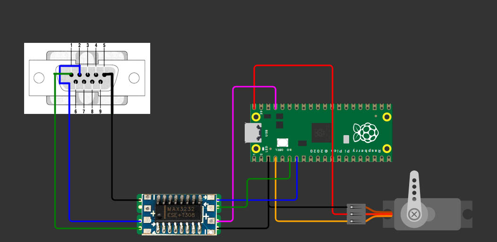

# Proyecto: Control de Servomotor vía RS232 – Raspberry Pi Pico

Este proyecto implementa un sistema de control de posición  para un servomotor utilizando una **Raspberry Pi Pico**  y
comunicación serie **RS232**. Una **PC** envía el valor de un ángulo (en grados) mediante UART, y la Raspberry Pi Pico 
interpreta ese valor para posicionar el servomotor en la posición correspondiente.

---

## Descripción del sistema

- La **PC** envía un valor numérico (ej. `90`) por el puerto serie.
- La **Raspberry Pi Pico** recibe este valor usando su UART.
- Se convierte el valor recibido en un ciclo de trabajo adecuado (PWM).
- El **servomotor** se mueve al ángulo indicado.
- El sistema interpreta comandos de texto simples (por ejemplo, `0`, `90`, `180`).

---

## ⚙️ Componentes utilizados

- Raspberry Pi Pico
- Módulo convertidor RS232 a TTL (MAX232 o equivalente)
- Servomotor (SG90 o similar)
- Fuente de alimentación externa para el servo (recomendado)
- Cables Dupont, protoboard, etc.

---

## Conexiones principales

| Componente         | Raspberry Pi Pico |
|--------------------|------------------|
| RX del módulo RS232| GPIO UART TX     |
| TX del módulo RS232| GPIO UART RX     |
| Señal del servo    | GPIO PWM (ej. GP15) |
| VCC y GND          | Según requerimientos |

---

## Archivos importantes

- `main.c`: lógica principal del sistema
- `servo.c/.h`: funciones para generar señal PWM y controlar el servo
- `uart.c/.h`: funciones para recibir datos desde la PC
- `hardware.h`: definición de pines y configuración

---

## Diagrama del circuito

---

## ⚠️ Notas

- El servomotor **no debe alimentarse directamente desde la Pico** si consume mucha corriente.
- Usar fuentes externas para evitar daños.
